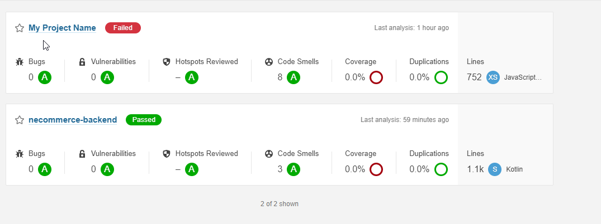
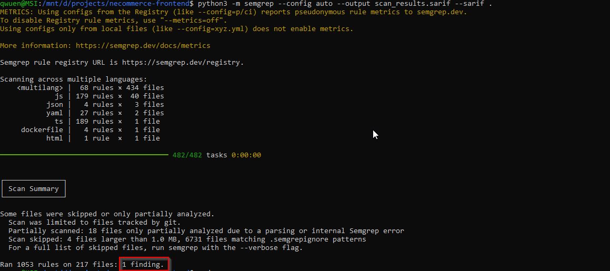
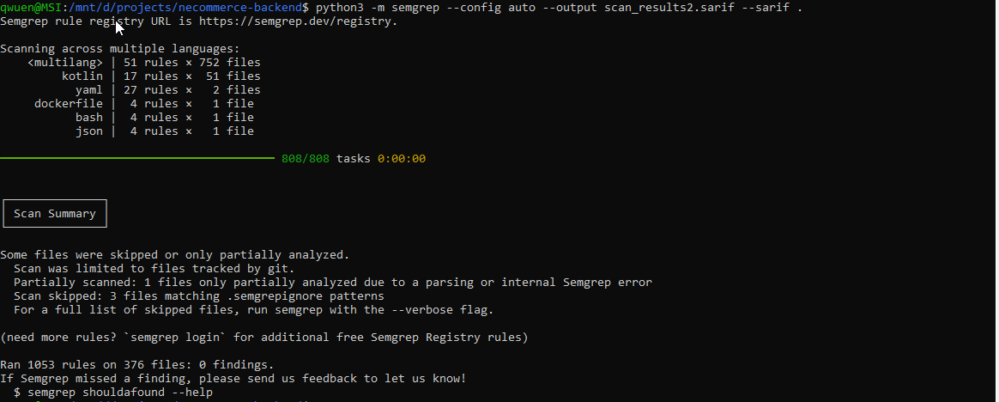
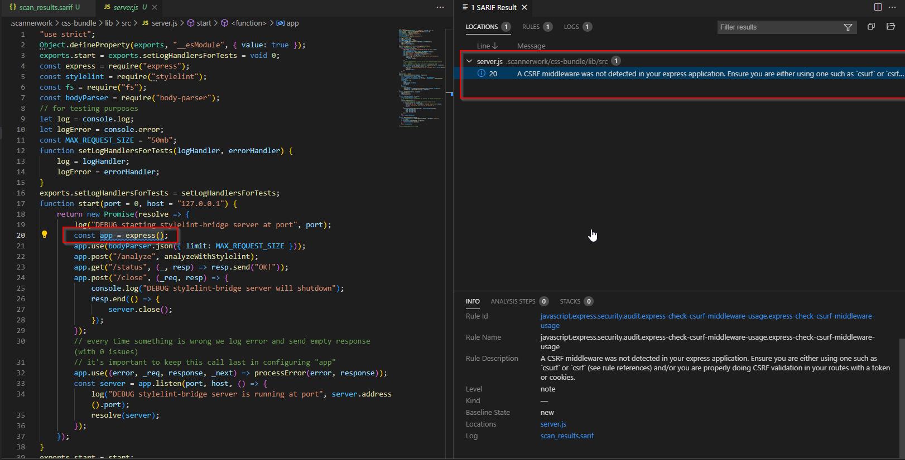
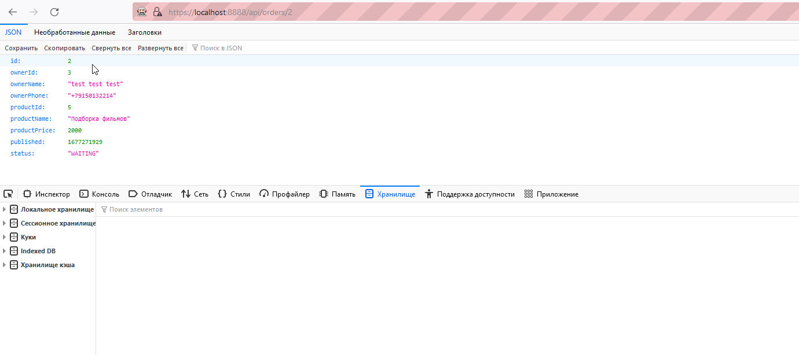
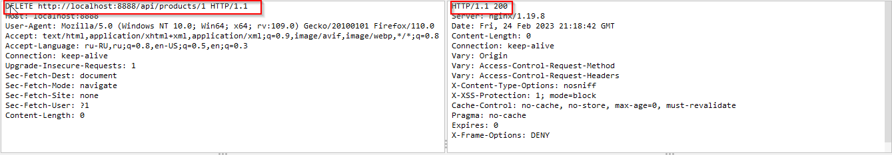

# Планирование.
В ходе выполнения курсовой работы планирую:
1. Провести анализ проектов, структуры проектов, используемых языков, механизмы деплоя и запуска приложений
2. Провести сканирование статическим анализатором
3. Провести динамическое тестирование приложений
# Выполнение работы.
## Ручной анализ проектов
### Анализ проекта `necommerce-frontend`
Проект написан на языке JavaScript с использованием кроссплатформенной среды исполнения кода NodeJs  
В проекте содержится:
1. `Dockerfile` для создания docker-образа и запуска приложения в контейнере  
`Настройка контейнера и дальнейшая работа приложения ведется от имени одного пользователя`
2. Файл `robots.txt` содержащий инструкции и директивы для поисковых роботов  
`Файл не раскрывает лишней информации`
3. Токен доступа хранится в локальном хранилище браузера  
`Доступ к токену есть из JS, поэтому вероятность провести XSS атаку`

### Анализ проекта `necommerce-backend`  
Проект написан на языке KotlinS
1. `Dockerfile` для создания docker-образа и запуска приложения в контейнере  
`Настройка контейнера и дальнейшая работа приложения ведется от имени одного пользователя`  
2. Потенциально нереализованная функциональность инвалидации токенов  
```
@Scheduled(initialDelay = 60 * 1000, fixedRate = 60 * 60 * 1000)
    fun invalidate() {
        // TODO: implement invalidation
    }
```
3. Потенциальная возможность просмотра заказа без проверки авторизации (IDOR)
```

    @GetMapping("/{id}")
    fun getById(@PathVariable id: Long) = service.getById(id)
```
4. Потенциальная возможность удаления сущности продукта без проверки авторизации
```

    @DeleteMapping("/{id}")
    fun removeById(@PathVariable id: Long) = service.removeById(id)
```
5. Файл конфигурации `fcm.json` содержит чувствительные данные, в т.ч. данные о закрытом ключе  

6. Небезопасная генерация токена  
```
private fun generateToken(length: Int = 128): String = ByteArray(length).apply {
        // lol
        random.nextBytes(this)
    }.let {
        Base64.getUrlEncoder().withoutPadding().encodeToString(it)
    }
```
7. Механизмы защиты csp, cors, csrf отключены в конфигурации приложения  
```
 http
            ?.cors()?.and()
            ?.csrf()?.disable()
```

```
 registerCorsConfiguration("/**", CorsConfiguration().apply{
            allowedOrigins = listOf("*")
            allowedMethods = listOf("*")
            allowedHeaders = listOf("*")
            allowCredentials = true
        })
```
## Сканирование статическим анализатором
В качестве статического анализатора использовал sonarqube и semgrep.  
Статический анализ результатов не дал.  





## Динамическое тестирование приложений
1. Отсутствие проверки авторизации при запросе заказа по идентификатору   

2. Отсутствие проверки авторизации и прав при запросе удаления продукта


# Рекомендации
1. При запуске приложения в контейнере использовать пользователя с минимально необходимыми правами
2. Убрать возможность просмотра заказа по идентификатору без авторизации 
3. Убрать возможность удаления сущности продукта без авторизации и проверки прав
4. Убрать из файла конфигурации чувствительные данные и задачать их через переменные окружения
5. Добавить заголовок Content-Security-Policy или X-Frame-Options для защиты от атак «ClickJacking».
6. Задать политику Content-Security-Policy для скриптов JS  
7. Задать CORS политику для уточнения списка доступных адресов  
8. При генерации токена использовать криптобезопасные механизмы  
9. Добавить механизм инвалидации токена авторизации при выходе из аккаунта  
10. Большинство проблем были выявлены после ревью кода. Рекомендуется в команде разработки выделить роль `security champion`